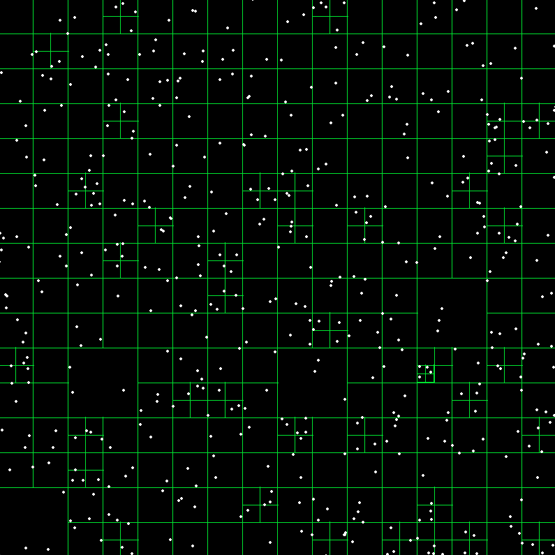
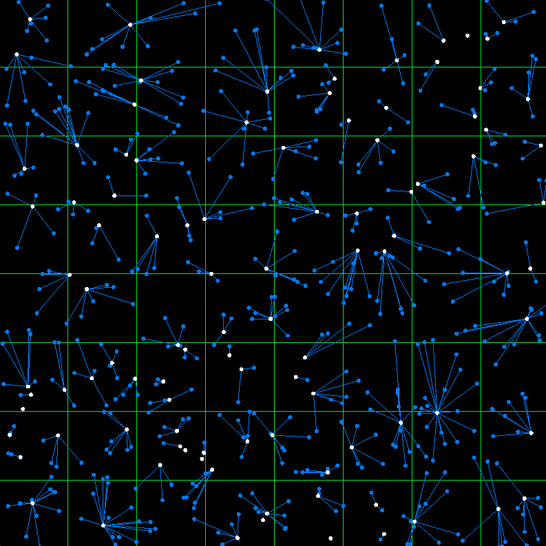
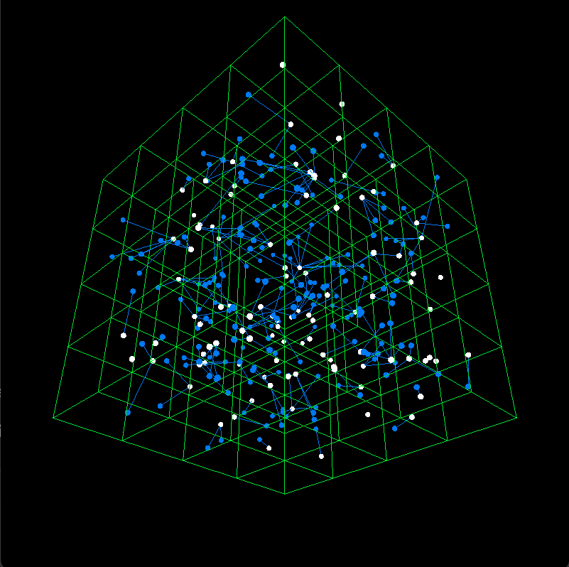

### Quadtree
White dots are points.

### Spatial Hash 2D
White dots are points. Blue circles are distance samples to the nearest point.

### Spatial Hash 3D
White dots are points. Blue circles are distance samples to the nearest point.
